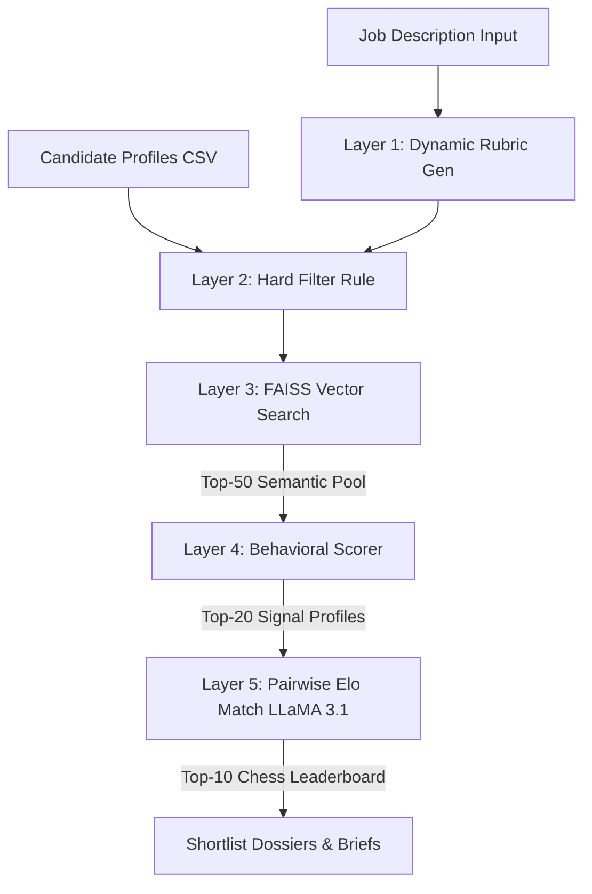

# TalentLens — Next-Gen AI Candidate Ranking Engine

> **Winner-grade Hackathon Entry:** Reimagining recruitment using dynamic rubric calibration, local vector semantic search, and comparative LLM chess-tournament re-ranking.

[](#)
[](#)
[](#)
[](#)

---

##  The Problem & The Vision

Traditional applicant tracking systems (ATS) are **broken**. They rely on crude keyword matching, causing:
* **Keyword Stuffing:** Unqualified candidates bypass screens by overloading resumes with buzzwords.
* **Manual Fatigue:** Recruiters spend hundreds of hours manually sorting through "semantic matches" that fail qualitative criteria.
* **Evaluation Bias:** Traditional scanning lacks audit logs and standardized rubrics.

**TalentLens** replaces keyword filtering with a **5-Layer Intelligent Assessment Pipeline** that evaluates candidates based on **deep-fit behavioral signals and direct tournament comparisons**. 

---

##  How It Works: The 5-Layer Evaluation Pipeline



### 1. Dynamic Rubric Generation (Gemini 3.5 Flash)
* TalentLens parses raw job description text and instantly computes a specialized **4-to-6 dimension evaluation rubric**.
* Weights are calibrated dynamically so the total sums to exactly `1.0`.

### 2. Hard Filtering (Deterministic Python Rules)
* Discards unqualified candidates early based on strict, non-negotiable rules (e.g., minimum experience, mandatory skills).
* Logs precise rejection reasons for transparent, compliant compliance reporting.

### 3. Semantic Vector Search (FAISS + Sentence-Transformers)
* Resumes are embedded using local `all-MiniLM-L6-v2` transformer models.
* FAISS performs high-speed cosine similarity searches, restricting the active pool to the **Top-50** semantic fits.

### 4. Behavioral Signal Scoring (Gemini 3.5 Flash)
* Standardizes qualitative achievements across four proprietary behavioral indicators (0-100):
  * **Quantified Impact:** Evidence of scale, percentages, or revenue achievements.
  * **Ownership Scope:** Level of initiative (e.g., "designed/led" vs. "assisted").
  * **Trajectory Velocity:** Career growth speeds and promo timelines.
  * **Rubric Alignment:** Precise mapping to the dynamically generated role rubric.

### 5. Pairwise Elo Re-ranking (LLaMA 3.1 70B via Groq)
* The Top-20 candidates enter a **head-to-head tournament matchmaker**.
* LLaMA 3.1 70B acts as the tournament judge, running pairwise comparisons. Candidates are sorted on a relative leaderboard using the **standard Elo chess rating algorithm** to yield the ultimate Top-10 finalists.

---

##  Premium User Interface & Telemetry

TalentLens features a **material-design dashboard UI** built from scratch to captivate at first glance:
* **Glassmorphic Bento Grid:** Sleek visual components mapping live pipeline statistics.
* **Immersive Vector Scan Reloader:** Telemetry overlays displaying real-time LLM execution states.
* **Interactive Modals:** Settings calibration, recruiter persona profiling, bias compliance auditors, and alert logs.
* **Dynamic PDF Uploads:** Real-time resume extraction.

---

##  Technology Stack

| Component | Technology |
|---|---|
| **Frontend** | React 19, Vite, TypeScript, Tailwind CSS, Lucide Icons |
| **Backend** | FastAPI (Python), Uvicorn |
| **Vector Search** | FAISS (Facebook AI Similarity Search) |
| **Local Embeddings** | `sentence-transformers/all-MiniLM-L6-v2` |
| **AI Processing** | Google Gemini 3.5 Flash, Groq LLaMA 3.1 70B |
| **Data Validation** | Pydantic v2, Pandas |

---

##  Quick Start — Running Locally

### Prerequisites
* Node.js (v18+)
* Python 3.10+

### 1. Clone & Environment Setup
Clone the repository:
```bash
git clone https://github.com/89Aman/Talentlens.git
cd Talentlens
```

Configure the backend `.env` inside `backend/`:
```env
GEMINI_API_KEY=your_gemini_api_key_here
GROQ_API_KEY=your_groq_api_key_here
PORT=8000
HOST=127.0.0.1
```

### 2. Launch the FastAPI Backend
Start the backend using the provided virtual environment:
```bash
cd backend
# Windows:
.\venv\Scripts\python.exe -m uvicorn app.main:app --reload --port 8000
# Unix/macOS:
source venv/bin/activate
uvicorn app.main:app --reload --port 8000
```
Verify the backend is live at: `http://localhost:8000/health`

### 3. Launch the React Frontend
Open a separate terminal window:
```bash
cd frontend
npm install
npm run dev
```
Open `http://localhost:3000` in your browser.

---
##  Hackathon Demo Guide

1. **Lock Screen:** Unlock the dashboard using your recruiter name key.
2. **Dashboard Setup:** Select a candidate pool CSV (e.g. `recommendation_engine_pool.csv`) and paste your custom Job Description requirements.
3. **Trigger AI Vector Scan:** Click **Run TalentLens**. Watch the visual telemetry progress bar load model weights, extract embeddings, run FAISS retrieval, and score candidates in real time.
4. **Recalibrate Rubrics:** Navigate to the **Calibration** tab to customize dynamic weights and inspect precision signals.
5. **Inspect Finalists:** Go to the **Rankings** tab, click **Detail** on any finalist (e.g. Jane Doe) to deep-dive into behavioral citations, raw parsed resume text, and tailored interview strategies.
6. **Bias Compliance Audit:** Check the **Settings** modal and toggle **Bias Audit Mode** to audit NYC LL 144 compliance rules.

---

##  License
Licensed under the Apache-2.0 License.
